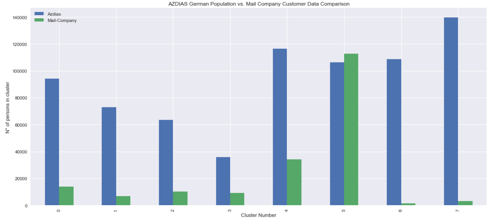
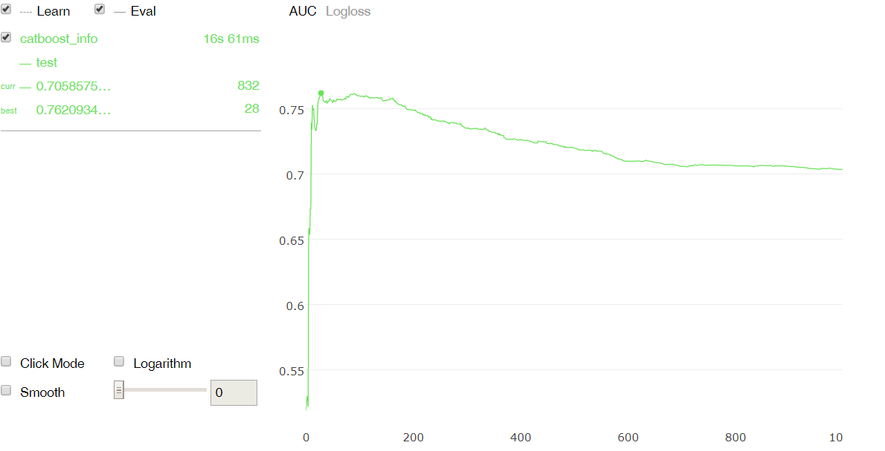

# Machine Learning Engineer Nanodegree Udacity Specializations

## Arvato Financial Services: Identify Customer Segments

## Project Motivation

The goal of this project is to apply machine learning techniques in order to predict which individuals are most likely to convert into becoming customers for a mail-order sales company in Germany using data provided by Arvato Financial Solutions.

## Files Description

-  Jupyter Notebook for Customer segmentation.
-  Jupyter Notebook for Supervised Model.
-  REPORT.md
-  utils  is a collection of small Python functions.
-  data_types.csv,dias_unknown.csv,mixed_features.xlsx Auxiliary files.

## Software and Libraries

* NumPy
* Pandas
* scikit-learn
* Matplotlib
* Seaborn
* XGBoost
* CatBoost
* imbalanced-learn
* BorutaPy

## Results of the Analysis

- Preprocessed and clean the dataset based on column/feature properties and the auxilary files provided.
- Applying PCA to reduce dimensionality based on the cumulative explained variance.
- Using the Elbow method to determine the optimal number of clusters with KMeans.
- Using KMeans  to segment the population (into different clusters) to recommend the potential customers for the company.
- Compare cluster assigment with a some features.

58 % percent of the customers' data fit in the cluster with label 5.
The company can take this population as future customers in Germany, since they share similarities.
With the population file we can see that 14 % of the clients are located in that cluster. Those 106380 are the targeted clients for a marketing campaign.
- Apply Supervised Learning to predict whether or not a person became a customer of the company following the campaign.

The following estimators were tested :

  - LogisticRegression
  - XGBoost
  - RandomForest
  - CatBoost

- Analyzed the feature importance  by machine learning model and compare the feature distribution between target/non-target population.

