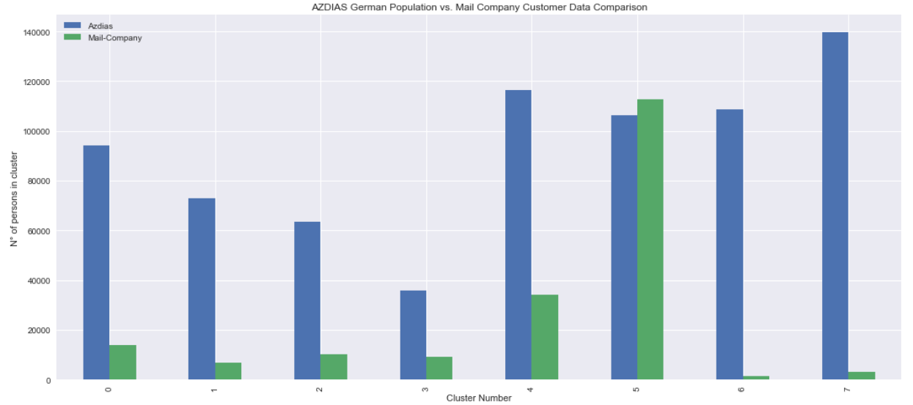

# Machine Learning Engineer Nanodegree
## Capstone Project
Sebastian Uribe  
December, 2019

## I. Definition

### Project Overview

[Arvato Bertelsman (Financial Solutions Division)](https://finance.arvato.com/en/) is an international financial service provider from Germany, they offer solutions related to ID & Fraud Managemet, Credit Risk Management, Payment & Financing Services and Debt Collection Services. Like every company with a marketing department, it is important to understand who their customers are, what are their characteristics, how is their payment behavior and more,  all important information to provide a good service, but most importantly to keep profits up !.

For any company( not only Arvato ), designing efficient marketing campaign on how to acquire new customers is not an easy task, it involves a series of multiple studies to understand customers information and design strategic campaigns to maximize customer’s acquisition taking into consideration the cost of the campaign. You can't just send ads to any non-client with publicity, too much money spend and with little ROI [1](https://www.lyfemarketing.com/blog/average-advertising-costs/),  its more effective to send ads to those who shares similar characteristics to your already clients.  The big and important questions is "*what are those characteristics that groups my clients based on their characteristics ?*". Thankfully  some Machine learning methods we can answer it.

### Problem Statement
The goal of this project is to perform and analyze a customer segmentation that allows the principal characteristics of the core business customers. This finding’s will be later be used as part of information to predict which individuals are most likely to convert into new customers. 

From Arvatos perspective, this project might help answering the following questions: 

* *How can the mail-order company acquire new clients more efficiently*.
* *Which people are most likely new customers ?*

This kind of problem is both an unsupervised and supervised machine learning problem. 
For the unsupervised part of the project, we are provided with features of demographic data from population of Germany and customers of the mail-order company to apply any clustering technic looking patterns to segment posible clients. There is not right anwser here, but the answer must be according to the financial needs of Arvato. 
For the supervised part, it is clearly a classification problem, with a binary target that represents which individuals are most likely to be new customers (Represented as **1**) and those who are not very liekly (Represented as **0**). 

### Metrics
**Customer Segmentation Stage** : Commonly, unsupervised models don't have a right answer, this must depend on the type of problem and the business goals, but we can use the [Silhouette Score](https://scikit-learn.org/stable/modules/generated/sklearn.metrics.silhouette_score.html) to get an idea of consistency within the clusters, where the intra-cluster distance (a) and the mean nearest-cluster distance (b) is calculated for each sample. 

The Silhouette Coefficient for a sample is :

$$Silhouette Coefficient = {(b-a)\over max(a,b)}.$$

Same again, without knowing much about the business goal we can use the  [Elbow Method Heuristic](https://www.oreilly.com/library/view/statistics-for-machine/9781788295758/c71ea970-0f3c-4973-8d3a-b09a7a6553c1.xhtml) to determine the optimal number of clusters by measuring the within cluster sum of errors (*WCSS*). 
*WCSS* is the summation of the each clusters distance between that specific clusters each points against the cluster centroid. 

**Supervised Stage** : 

Area Under the Receiver Operating Characteristic Curve [ROC AUC](https://scikit-learn.org/stable/modules/generated/sklearn.metrics.roc_auc_score.html) is a common metric used when predicting the probability  for binary classifiers, since this is the evaluation metric at the [Kaggle - Udacity challengue](https://www.kaggle.com/c/udacity-arvato-identify-customers/overview/evaluation), this will be the metric to evaluated the selected model.

### Benchmark-model

As this project is part of the
[Kaggle-Udacity challengue](https://www.kaggle.com/c/udacity-arvato-identify-customers/overview/evaluation), the benchmark model would be the Kaggle scores
found in the leaderborad. We can see that the top 20 submission scores
(AUC) are above 0.80 . Something near to 0.80 will be awesome!.

## II. Analysis

### Data Exploration

There are four data files associated with this project:

- Udacity_AZDIAS_052018.csv: Demographics data for the general population of Germany; 891211 persons (rows) x 366 features (columns); 

- Udacity_CUSTOMERS_052018.csv: Demographics data for customers of a mail-order company; 191652 persons (rows) x 369 features (columns).

- Udacity_MAILOUT_052018_TRAIN.csv: Demographics data for individuals who were targets of a marketing campaign; 42982 persons (rows) x 367 (columns). There are 273 features with at least one missing value.

- Udacity_MAILOUT_052018_TEST.csv: Demographics data for individuals who were targets of a marketing campaign; 42833 persons (rows) x 366 (columns). There are 273 features with at least one missing value.

Each row of the demographics files represents a single person, but also includes information outside of individuals, including information about their household, building, and neighborhood. Use the information from the first two files to figure out how customers ("CUSTOMERS") are similar to or differ from the general population at large ("AZDIAS"), then use your analysis to make predictions on the other two files ("MAILOUT"), predicting which recipients are most likely to become a customer for the mail-order company.

The "CUSTOMERS" file contains three extra columns ('CUSTOMER_GROUP', 'ONLINE_PURCHASE', and 'PRODUCT_GROUP'), which provide broad information about the customers depicted in the file. The original "MAILOUT" file included one additional column, "RESPONSE", which indicated whether or not each recipient became a customer of the company. For the "TRAIN" subset, this column has been retained, but in the "TEST" subset it has been removed; it is against that withheld column that your final predictions will be assessed in the Kaggle competition.

In a preliminary analysis 2 things are found : 
    1. There are a lot of missing values in these datasets
    2. Not all of the listed features have explanation in the given Excel spreadsheets,  there are only 275 out of 366 items in the Excel spreadsheets. 

#### Missing Values Columns

Dataframe has 366 columns, but 273 has at least one missing values

**BUT!** According to *DIAS Attributes-Values 2017.xlsx* file

it could be worse than expected, some features are represented with -1 or 0 when the data is missing or unkonw.

Using the DIAS *Attributes-Values 2017.xlsx* file we can use it to complete missing data and replace it with proper values used in the file. Based on this file, I created the dias_unkown.csv file (For the Creation of the file please refer to the data data_script.py. This file can be used to understand which value correspond to a unknown or missing data. Values that correspond to missing value codes of AZDIAS dataset were converted to np.nan values and the final number of missing values were analyzed for each attribute.

It looks like that our Dataframe now has 334 features with at least one missing values.

The analysis demonstrates that most of the columns have less than 30% of missing data. 

There are 66 attributes with more than 30% of missing data (see the boxplot of missing values in the above graph). These 66 attributes were dropped from analysis.

#### Missing Values Rows

Taking the same idea now with rows. 

There are a lot of clients that are missing a lot of information, those clients might be not worth saving, since the final output will be a client with almost every feature fill with the mean, median or mode of the corresponding feature. 

Thankfully we have a lot of clients, if we set a threshold of 25 % of missing data, we can see that if we drop them we will loose only 12 % of the full dataset.. Yes, thats not ideal but it is prefered to work with real data, than with a lot of impute information

### Cleaning and Preprocessing
I create a file name *data_types.csv* manually, checking each feature with the DIALES Files to determine if a columns was numeric, categorical , or datetime. I add a column to express if the categorical feature can be represented in an ordinal way or needs to be represented in one hot encoding. Since not all of the columns were found in the Excel, I had to guess the type of it.

Additionally I created an annotations columns where I wrote some notes regarding to the preprocess.

The File looks like the following:

    1. LNR was set as index
    2. Based on the description files, some features shares similarities and some of them can be droped. 
    3. Some Features can be RE-ENCODE into a simpler way. 
    4. Features like PRAEGENDE_JUGENDJAHRE and CAMEO_DEUINTL_2015 have mixed features type of data that can be extract
    5. Some features can be drop with no harm.
    6. There are some features that presenet XXX values that need to be replace

Computing the pairwise correlation the following columns shows a correlation > 0.95

Each one of the was analyzed to drop the corresponding features. 

Here is an example : 

LP_FAMILIE_FEIN and LP_FAMILIE_GROB are highly correlated, and LP_STATUS_FEIN and LP_STATUS_GROB are also highly correlated... Based on the graph above and the descriptions found in the DIAS File... I decide to drop 'LP_FAMILIE_FEIN','LP_FAMILIE_GROB'

#### Engineer Mixed-Type Features

PRAEGENDE_JUGENDJAHRE and CAMEO_INTL_2015 has more information that can be extract. 

    PRAEGENDE_JUGENDJAHRE 
        Split into : GENERATION_DECADE, Type , MOVEMENT
        

    CAMEO_INTL_2015
        Split into : Wealth & LifeStage
        

#### NaN
An strategy to deal with the rest of features with NaN will be imputation with median or most frequent value. Statistcally this doesnt affect the feautre distribution. This is way much butter than dropping points as also it gives more accurate results than dropping data points or columns entirely.

    Numerical data will be imputed with median value in the column to deal with outliers.

    Categorial data will be imputed with the most frequent value.
    
There are :

|   Type   | Count |
|:--------:|:-----:|
| Numeric  | 9     |
| datetime | 3     |
| Category | 357   |
|          |       |

In summary, the cleaning procedure (clean_data function):

     1 Drops columns and rows.
     2 Reengineers mixing type features
     3 Handle missing data with median or mode. 

#### Dimensionality Reduction 

After cleaning the dataset, we end up with a shape of (737288, 428). 

Each data point has 428 features, which means the data is 428-dimensional. Clustering algorithms rely on finding clusters in n-dimensional feature space. For higher dimensions, an algorithm like k-means has a difficult time figuring out which features are most important, and the result is, often, noisier clusters.

Some dimensions are not as important as others, wee need values that vary between clients.

We want to find the features that help to separate and group data. We want to find features that cause the most variance in the dataset!

The technique I’ll use is called **PCA** or principal component analysis.

**PCA** attempts to reduce the number of features within a dataset while retaining the “principal components”, which are defined as weighted, linear combinations of existing features that are designed to be linearly independent and account for the largest possible variability in the data.

#### StandarScale

Standardization procedure was used to scale features before applying the PCA. The standardization procedure removes the mean and scale to a unit variance, making analysis much less affected by outliers and the difference in scales.  

Analyzing the cumulative explained variance vs a number of principal components we can see that arpund ~186 components, 90 % of the variance is explained. Therefore I will choose this as my number of components. 

### Clustering

Elbow method was used to identify an ideal number of clusters for k-means clustering on the PCA-transformed data. Average of sum of squared errors (SSE) within-cluster distances was plotted against number of clusters from 3 to 20.

Number of clusters was corroborated measuring Silhoutte Score. 

Looking at the plot above, we can notice that the score keeps decreasing and there is a visible elbow after 5 clusters, I will choose 8 clusters to do KMeans clustering.

The silhouette_score is not the best, ideally a good score is above 0.5, but we are using a sample since this process takes a lot of time, so don't panic.

Plotting the cluster in 2D graph : 

it look kind of nice, some clusters are well separated from the others, but it kinda looks some might overlap, which is totally fine, not the best scenario but we can work with that.  

If we check the distribution of the clusters we found that: 

Customer dataset was pass through the same cleaning steps, in order to use the same kmeans model to assigned customer data into the non-customer population clusters and compare similarities between them.

58 % percent of the customers' data fit in the cluster with label 5.

The company can take this population as future customers in Germany, since they share similarities.

With the azdias file we can see that 14 % of the clients are located in that cluster. Those 106380 are the targeted clusters.

Analyzing some feature of the cluster with label 5: 

Above are some of graphs used to understand the target customer, with this we can start to form a picture of who they are.

Characteristics:

- Single
- Top earners
- Passive elderly - Higher age. 
- Retired. 
- Houseowrners from rural neighbourhood or residental building
- Consumption type : inactive
- Financialy money savers or unremarkable
- Typification of energy consumers : green | smart
- Advertising- and Consumptiontraditionalist
- TOP CAMEO International Customer Classifications : String Trimmer, Fine Management, Petty Bourgeois, Secure Retirement

### Supervised Model

We have found which parts of the population are more likely to be customers of the mail-order company, it's time to build a prediction model.

Each of the rows in the "MAILOUT" data files represents an individual that was targeted for a mailout campaign. Ideally, we should be able to use the demographic information from each individual to decide whether or not it will be worth it to include that person in the campaign.

The "MAILOUT" data has been split into two approximately equal parts, each with almost 43 000 data rows. In this part, you can verify your model with the "TRAIN" partition, which includes a column, "RESPONSE", that states whether or not a person became a customer of the company following the campaign. In the next part, you'll need to create predictions on the "TEST" partition, where the "RESPONSE" column has been withheld.

MAILOUT dataset was re-enconde with the correct NaN values and those rows where drop. There are low count of the minority class, it is a higly unbalanced dataset, so loosin information of those 1 is important and avoid at all cost. 

BUT after a few trials, I decided to drop every row  with the NaN cause I was getting an overfitted model, around 

Same cleaning steps used in the customer segmentation were used to clean the mailout dataset. 

There are many features and hardly all of them we can use to fit our model... Therefore I will apply some feature selection techniques to reduce the number of features and select just those that present highly importance for the model.

I used [ANOVA (Analysis of Variance)](https://towardsdatascience.com/anova-for-feature-selection-in-machine-learning-d9305e228476) :
The variance of a feature determines how much it is impacting the response variable. If the variance is low, it implies there is no impact of this feature on response and vice-versa.
Top 10 of importance features with ANOVA

The [Boruta](https://www.datacamp.com/community/tutorials/feature-selection-R-boruta#boruta) algorithm is a wrapper built around the random forest classification algorithm. It tries to capture all the important/ interesting features with respect to an outcome variable.
Boruta confirmed the following variables: 

The final features used were decide with the following criteria : 
I kept the features found by Boruta + ANOVA Top 10

I splitted the data in a 70/30 ratio.. I trained with 70% of the data and  tested with the rest.

For each of the models tested I created a pipeline to clean and preprocessing the data according to the model, each model undergoes through a Hyperparameter tuning step with a GridSearchCV to evaluated a number of parameters with an intermediate step for a cross-validation to avoid any overfitting. 

LogisticRegression : 

    Pipeline for preprocessing a LogisticRegression Model.
    
    Numeric Features:
        1. Impute with Median
        2. Standardize features by removing the mean and scaling to unit variance
    Categorical Features:
        1. Impute with Mode. 
        2. OneHotEncoder (dummies)

    Results: 

        ROC AUC       :0.7255
        Precision     :0.0240
        Recall        :0.8
        F1            :0.0466

RandomForestClassifier

    Parameter class_weight='balanced') was used due to the imbalanced dataset
    
    Pipeline for preprocessing a RandomForest Model.

    Numeric Features:
        1. Impute with Median
    Categorical Features:
        1. Impute with Mode. 
        2. OneHotEncoder (dummies)

    Results:
        ROC AUC       :0.7986
        Precision     :0.0315
        Recall        :0.8941
        F1            :0.0609

XGBoost

    One way to used XGBoost with imbalanced dataset is to set the scale_pos_weight attribute:
    
    scale_pos_weight : float
        Balancing of positive and negative weights.

    Pipeline for preprocessing a XGBoost.
    
    Categorical Features:
        1. OneHotEncoder (dummies)

    XGBoost can handle NaN very good, so I will drop this step in the pipeline

    Results:
    ROC AUC       :0.772
    Precision     :0.032
    Recall        :0.870
    F1            :0.063
    

CatBoost. 

Advantages: Handling Categorical features automatically

According to documentation . CatBoost provides great results with default parameters.

I will not try any tunning with this model.

Pipeline for preprocessing a CatBoost.
    
    Categorical Features:
        1. OneHotEncoder (dummies)

    CatBoost can handle NaN very good, so I will drop this step in the pipeline

    Results:
    ROC AUC       :0.76
   

not so bad since it is a really imbalanced dataset.

RandomForest presents the highest AUC score, but !

testing in the testing tt looks like the RandomForest overfits a little. 

Therefore XGBoostClassifier was selected. 

Analyzing feature importance of the final model : 

in every iterations D19_SOZIALES was always the most importance feature, therefore I will analyze this feature to understand why is so important. 

It is clear why D19_SOZIALES is such a strong feature, people who belongs to class 1 cleary have just value 1 in this category.

## Kaggle submit

The cleaning process was performed to the MAIL_OUT_TEST dataset. 

Lastly, XGBoostClassifier was selected and fit over the whole traindataset with a cross validation of 5 k-folds, to make predictions over testing dataset on KAGGLE.

The resulted performance of supervised learning algorithm is 78.8%.

Nearly 0.8!... I will keep trying to achive it. 

## Improvement

**Customer Segmentation**

Something to try out, could be to fill missing values with -1 instead of the mean or mode. This could help to create a cluster with missing values and keeping other clusters without any miss leading information based on imputation.

There are other clusterings techniques to try like :

* Gaussian Mixture Models
* Spectral Clustering
* DBSCAN

As well other Dimensional Reduction Techniques like:

* NMF
* t-sne

**Supervised Model**

There are a few thing I will like to try out to improve the score, here are a few ideas : 

* Find a way to keep more rows of the minority class without overfitting the model. 
* Feature Selection with Recursive Feature Elimination might bee a good idea to try. 
* Engineer more variables, maybe try something with the datetime features or a library like FeatureTools
* LightGBM looks promising and it can compare with the XGboost and CATBoost. 
* Hyperparameter tunning with CATBoost. 
* Bayesin optimization. 
* Maybe apply unsupervised and supervied to boost performance. 
